```{r setup, include=FALSE}
knitr::opts_chunk$set(echo = TRUE)
```

# Submission Details

*   **Tutorial Title:** Clustering with DBSCAN
*   **Authors:** 
    *   Suzanne-Kae Rocknathan (1004617)
    *   Vaishnavi Divya Shridar (1004600)
*   **Course:** 40.319 Statistical and Machine Learning
*   **Semester / Year:** Term 7, 2022
*   **Submission Date:** 20 April 2022

# Welcome to our Blog

*   View our **table of contents** in the side bar
    *   Click on a section name to navigate there and view its sub-sections
    *   Or simply scroll down to read more
*   Toggle to **night mode** in the side bar if it suits your preference
*   Click the graphs and images to take **a closer look**
    

# Load Packages and Clear the Environment
```{r, message = FALSE}
rm(list = ls())

#install.packages("rmdformats")    # for html theme
#install.packages("factoextra")
#install.packages("fpc")
#install.packages("dbscan")
#install.packages("gifski")


library(factoextra)      # for dataset and visualization
library(ggplot2)         # for visualization
library(stats)           # for kmeans() function (kmeans clustering)
library(cluster)         # for the silhouette() function
library(kernlab)         # for specc() function (spectral clustering)
library(fpc)             # for dbscan()
library(dbscan)          # for dbscan()
library(gifski)          # for animation
```

# Motivation

## The Dataset

Given a dataset that looks like this...
```{r, echo=FALSE}
data("multishapes")
df <- multishapes[, 1:2]
#head(df)

ggplot(df,
       aes(x,y)) +
  geom_point()
```

> How would you group these points?

## Let's try clustering it!

Previously, we learned about 2 methods of clustering:  

*   K-means clustering
*   Spectral clustering

Let's take a look at how these methods would group the given dataset.

### K-means clustering plot
```{r, warning = FALSE, echo=FALSE}
set.seed(555)

km <- kmeans(df, 5, nstart = 25)

plot(df, col=km$cluster, main="K-means Clustering")
```
 
The clusters here aren't so accurate. 
Like we learned in class, `kmeans()` usually finds clusters that are spherical and non-overlapping, hence it **doesn't capture nested clusters** like the concentric ovals above.


### Spectral clustering plot

```{r, echo=FALSE}
set.seed(555)
sc <- specc(as.matrix(df), centers = 5, kpar = "automatic")

plot(df, col=sc, main = "Spectral Clustering", frame = FALSE)
```

#### Spectral clustering with sigma = 500

By adjusting the sigma parameter, we can get a better output.
```{r, echo=FALSE}
set.seed(555)
sc <- specc(as.matrix(df), centers = 5, kpar = list(sigma=500))

plot(df, col=sc, main = "Spectral Clustering (sigma = 500)", frame = FALSE)
```

The results are much better, but not perfect. 

Notice that...   

*   You have to adjust the sigma parameter to obtain the best clusters. 
    *   With multivariate datasets, you won't be able to visualize your plots to check if the clusters look appropriate.
*   The clusters **include noise** (ie. outliers).


> What if I told you there's a better clustering method for this dataset? 

### DBSCAN clustering plot

Let's take a look at how the DBSCAN method performs!
```{r, warning = FALSE, echo=FALSE}
set.seed(555)
db <- fpc::dbscan(df, eps = 0.15, MinPts = 5)

plot(db, df, main = "DBSCAN", frame = FALSE)
```

This method managed to not only **successfully group** each of the **visible clusters**, but also **identified the 'noise points'** (that is, points that don't belong to any cluster)!

> Interested to find out how this works? Read on to find out more!

# Context

Within the machine learning domains of supervised, unsupervised and reinforcement learning, clustering remains a key unsupervised learning method with a variety of applications. It is often used in the areas of:

* healthcare for biological data and medical imaging analysis
* marketing for market research and customer segmentation
* sociology for social network analysis

At its core, clustering is used in exploratory data analysis to visualize the similarity and to identify underlying patterns in data points. Thus, it aims to find the similarity within a cluster and the difference between two clusters.

## K-means Clustering
One such method, to separate datasets into smaller clusters, is K-means clustering. By choosing the number of clusters we want to see, the K-means algorithm iterates through the different data points, adding them to different clusters before identifying the combination that produces the minimal within-cluster sum of squared distances. It makes use of **Euclidean distance** to identify the distance between points and groups together points that are near to each other. However, it generally assumes that the produced clusters are spherical in nature, where clusters only form around centroids, as seen below.

<center>


</center>

> However, do we always want our clusters to be separated as such?

## Spectral Clustering
One alternative method to clustering is
spectral clustering. Unlike K-means clustering, even if data points are very near to each other with small distances, spectral clustering groups together points that are similar in nature. Thus, it overcomes the disadvantages of K-means in terms of the shape of the cluster, as well as the determination of the cluster centroid. As seen in the image below, a different clustering output is seen when spectral clustering is used, as compared to K-means. 

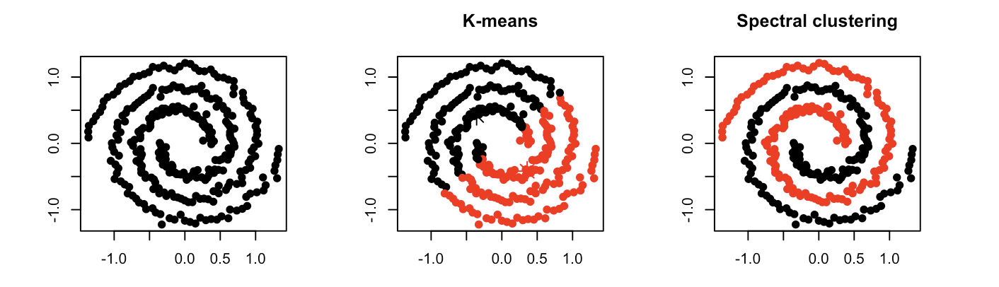

However, spectral clustering also requires the number of clusters to be determined before clustering occurs.

> Will we always know beforehand the number of clusters available? Additionally, will our datasets always be this clean?

## DBSCAN Clustering
To solve the two questions mentioned above, comes DBSCAN clustering aka **Density-Based Spatial Clustering of Applications with Noise** - a method that is robust in its identification of outliers, and does not require a strict number of clusters to be specified beforehand.

One key aspect of data analysis and visualization is data cleaning. In real-world datasets, like astronomy or location data to name a few, noise in data is often found and is difficult to completely remove via pre-processing methods. Thus, there is a  need for clustering methods to account for this noise present when identifying distinct groups.

DBSCAN is able to successfully achieve this, as seen below.

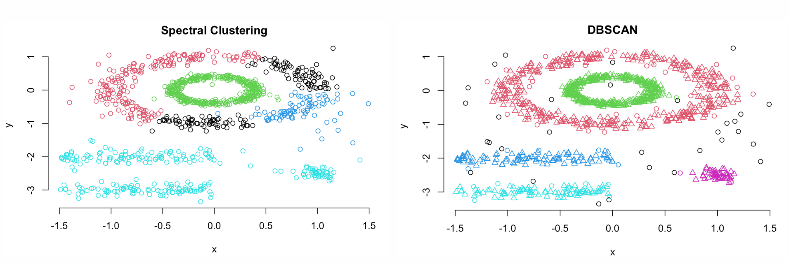


# Theory

## Understanding DBSCAN
Given a 2D dataset, it is relatively easy for the human eye to identify clusters of data points. However, as the dimensionality increases, it is difficult to visualise datapoints and thus, alternative methods are required to identify clusters. One such method is DBSCAN.

Let's try to understand this using a simple 2D example first. 

Assume we are given a dataset containing height and weight information, easily displayed in a 2D graph.

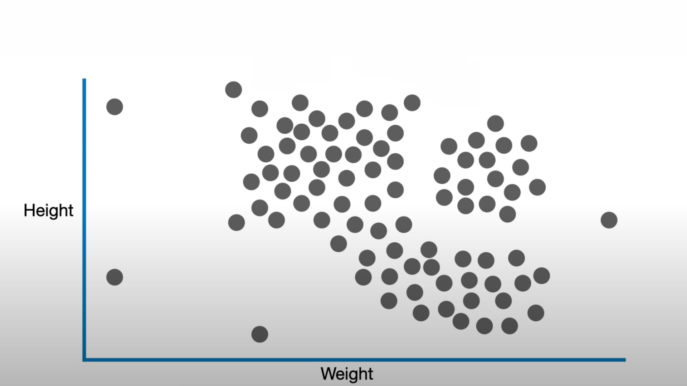

Based on our eyes alone, we can identify clusters in the given dataset.

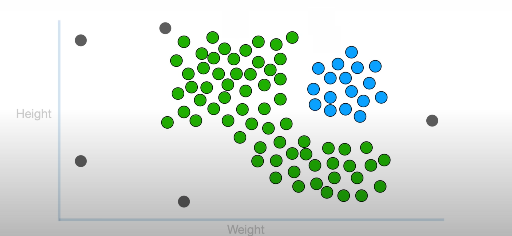

Similarly, DBSCAN does the same using **density**. Thus, it perceives clusters to be dense regions in space, with clusters separated by low density regions. In addition to point clusters, DBSCAN also identifies outliers or noise points that are not part of any cluster. 

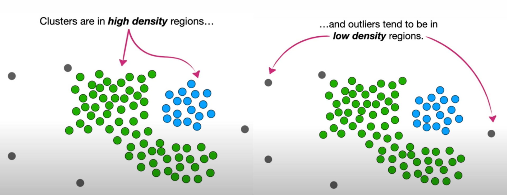


DBSCAN thus begins by counting the number of points near each point in the dataset. Starting at a random point in the dataset, it looks at the number of points surrounding the chosen point within a circle of radius \(\epsilon\).

Let's assume our starting point is the red one in the image below. As depicted by the orange circle, at least eight other points are overlapped within that circle. Thus, the red point has eight points near it, and it can be noted to be in a fairly dense region.

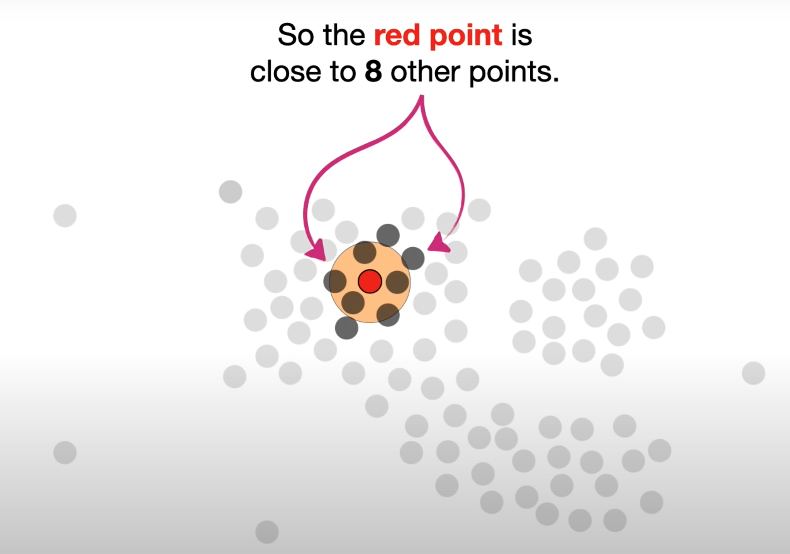

The radius, aka **epsilon** \(\epsilon\), is thus the first parameter required by DBSCAN. It is used to find the density around each point in the dataset. 

We continue to work through the entire dataset, having counted the number of points near every point in the dataset. This quantity is then used to identify if a point is a *core point* or a *non-core point*. 

> What is a core-point and why do I need it?

When identifying clusters, core points are those that are densely surrounded by points and the cluster expands from this core point to points around it. Thus, the core point is used in determining all the points within a cluster.  

On the other hand, non-core points, can be added to a cluster but are not used to add other points into the cluster. These non-core points tend to be in less dense regions. Every point is either a non-core point or a core one.

> But how dense is dense enough for a point to be considered a core point?

The minimum number of surrounding points to determine whether a point is a core point is denoted as **minPoints**. This is the second and final parameter required by DBSCAN. 

Let's assume **minPoints** = 4 for the purpose of this exercise. With core points pictured in red and non-core points in black, we see the following categorization in our dataset. 

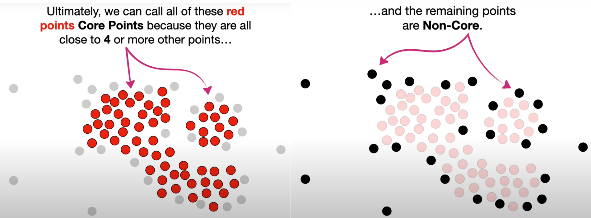

## Parameters
To summarize, DBSCAN requires two main parameters:

1. **epsilon** \(\epsilon\) : the radius of the circle to be created around each data point to check density. 
2. **minPoints**: the minimum number of points required in the shape of each dataset that is a core point. 

> Given these parameters, how do my clusters form?

## Visualizing Clustering
As mentioned previously, we have counted the number of points near every point in the dataset, and then identified if each point is a core point or non-core point. 

Beginning at any random core point, we assign it to our first cluster. Next, the core points surrounding this core point are also assigned to the first cluster. The core points that are close to this growing first cluster are also added to it, and so on and so forth until there are no more core points near this cluster.

Assuming the clustered points to be in green, we end up with the following: 

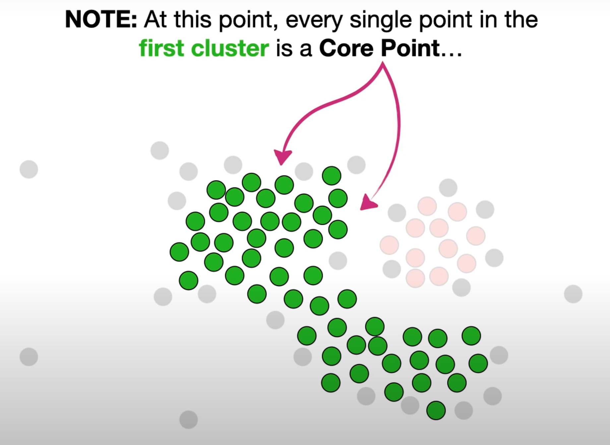

We then look at the non-core points that are near the core points in the first cluster, and add those to the first cluster. Other non-core points that are near these non-core points, are not added to the cluster. 

With that, we have created our first cluster!

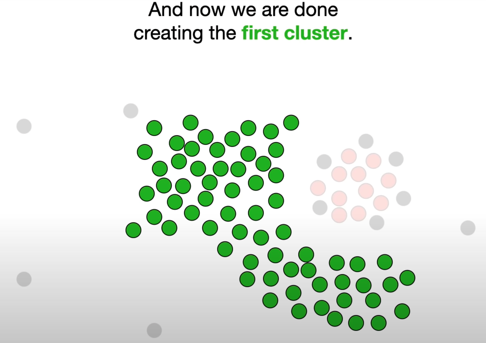

Before we move onto the next cluster, let's revisit how we made the first one through a short animation.

<center>


</center>

With our first cluster being formed, we then move onto the next set of densely clustered core points that are away from the first cluster. Repeating the process above, we extend the cluster through all the nearby core points, before adding the non-core points neighbouring the core points when there are no core points left. 

Thus, we have formed our next cluster, as seen in blue!

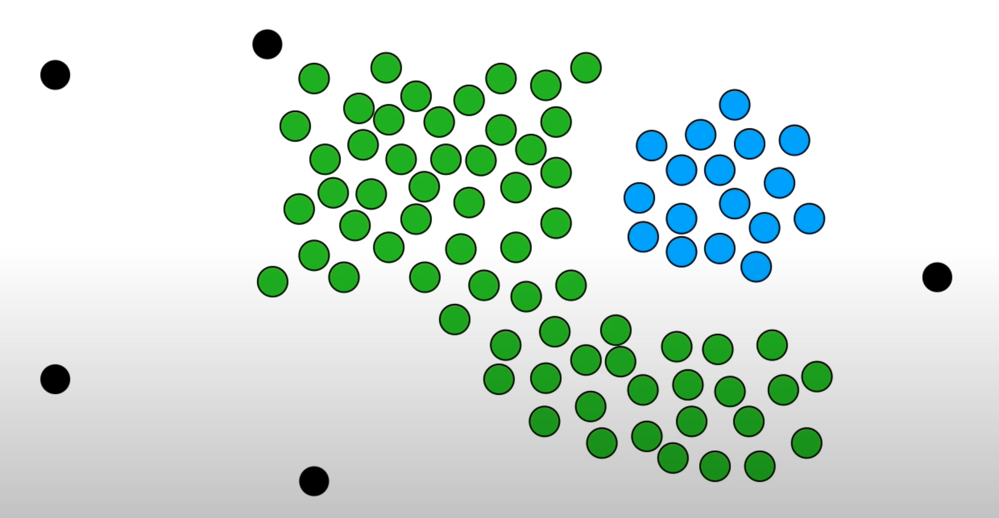

Now, do note that we have no other core points left, with unclustered points in black above. 

> What now?

Instead of forming a new cluster, all these points are identified as outliers or noise. And now, the DBSCAN algorithm is done!

> Now that we've understood the basics, let's learn about some of the more technical concepts!

## Density Perspective
The relationships between datapoints can be separated into two main concepts of reachability and connectivity:

1. **Reachability**: if a data point can be accessed from another data point directly or indirectly
2. **Connectivity**: whether two data points belong to the same cluster or not

Thus, two points in DBSCAN can be referred to as directly density-reachable, density-reachable or density-connected.

> What does this mean?

* **Directly Density-Reachable**: $q$ is directly density-reachable to $p$ if $p$ is a *core point*, and $q$ belongs near $p$ (that is, the distance between $q$ and $p$ is less than the *epsilon* radius). While $q$ may be directly density-reachable to $p$, it does not imply that $p$ too is directly density-reachable to $q$ since $q$ may not be a core point.

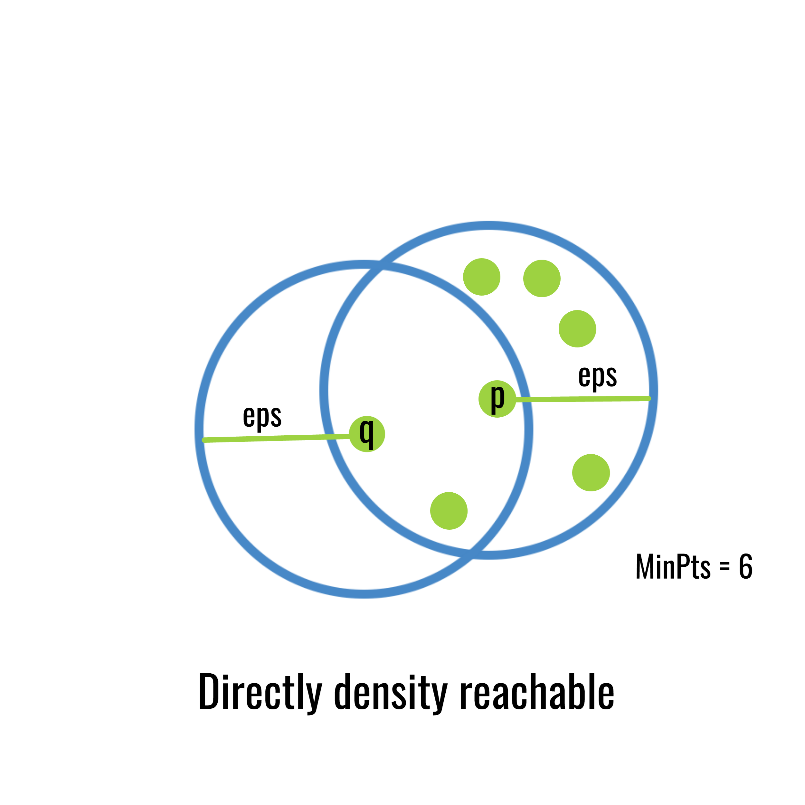{width=50%}

* **Density-Reachable**: $q$ is density-reachable to $p$ if there is a series of points $q_1, \ q_2,\ ..., \ q_n$, with $q_1 = p$ and $q_n = q$ such that $q_i + 1$ is *directly density reachable* from $q_1$ for all $1 \leq i \leq n$. While $q$ may be density-reachable to $p$, it does not imply that $p$ too is density-reachable to $q$. 

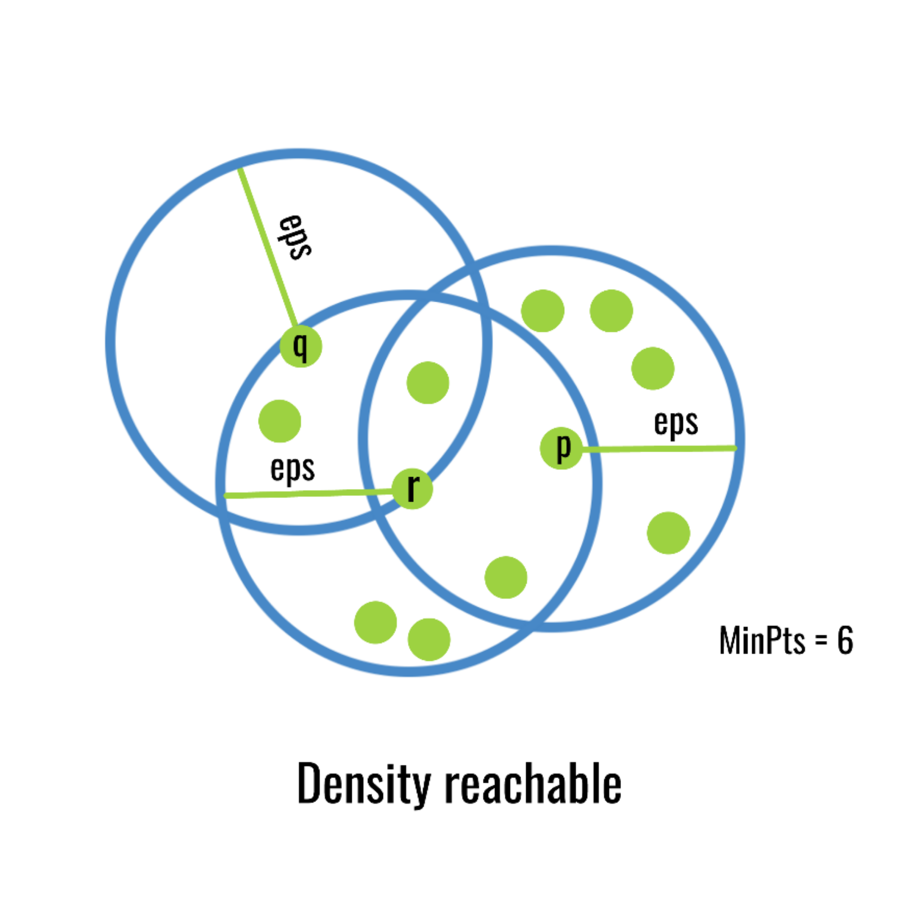{width=50%}

* **Density-Connected**: $q$ is density-connected to $p$ if there is a different point $o$ such that both $p$ and $q$ are density reachable from $o$. Note that unlike the previous terms, density connectivity is symmetric such that if $q$ is density-connected to $p$ then $p$ is also density-connected to $q$.


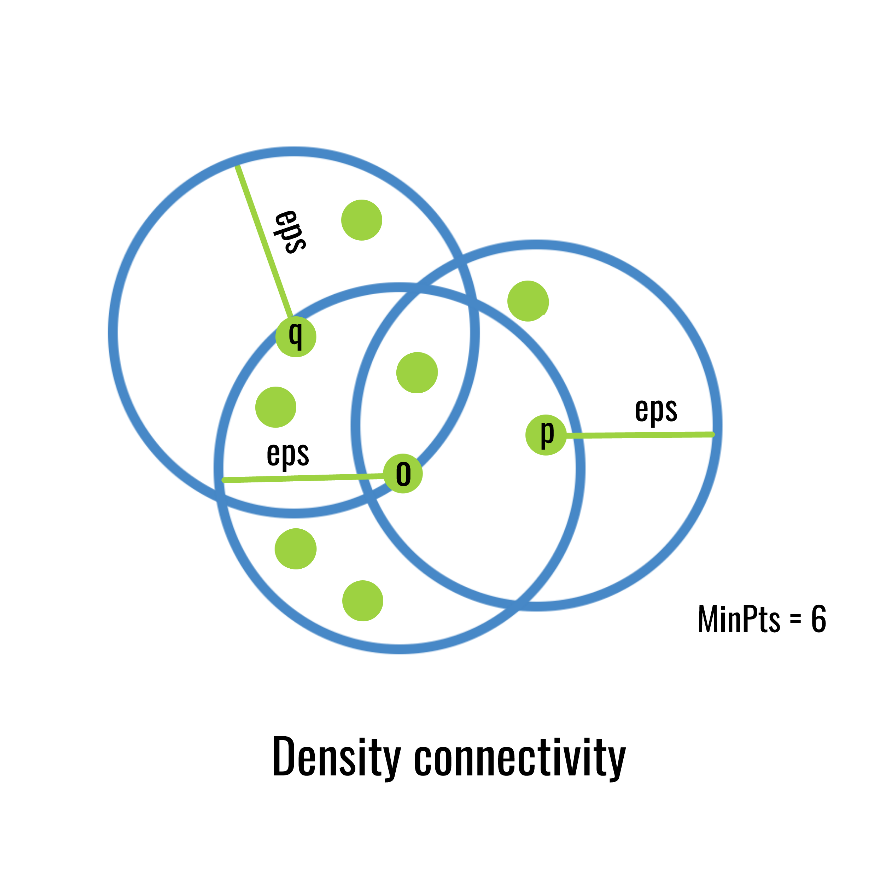{width=50%}

The relationships between the points above can be used to define the clusters and noise points.

* **Cluster C**: is a non-empty subset of all points where:
  * for all data points $(p,q)$, if $p$ is within C and $q$ is density-reachable from $p$, then $q$ is within cluster C
  * for all data points $(p,q)$ within C, $p$ is density-connected to $q$ and vice versa.
* **Noise points**: point that is not directly density-reachable from at least one core point.

Thus, based on the above method, the DBSCAN algorithm:

1. Finds all the neighbour points within *epsilon* and identifies points with more than *minPoints* neighbours nearby.
2. For each of the identified points, if it has not been assigned to a cluster, a new cluster is created.
3. Recursively, find all density-connected points near these identified points and assign them to the same cluster.
4. Iterate through the remaining un-visited points in the dataset and those that do not belong to any cluster are interpreted as noise points.

{width=50%}

> This is too dense to understand... Is there a different way to look at it?

## Mathematical Perspective
As mentioned above, DBSCAN creates a shape of *epsilon* radius around the datapoints and then classifies them into three main points:

* **Core point**: shape around the data point contains $\geq$ *minPoints* number of points
* **Border point**: shape around the data point contains $<$ *minPoints* number of points
* **Noise**: no other core points nearby within the *epsilon* radius

Let's set *minPoints* = 4, with an arbitrary *epsilon* distance. How will a group of points be distributed?

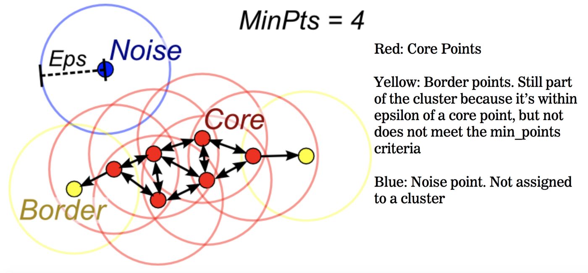

> The image above gives a good visualisation on how the different points can be distinguished.

Thus, the DBSCAN algorithm:

1. Beginning at a random point (one of the red points in the image above):
     * DBSCAN forms a shape around that data point and counts how many data points fall within that shape, with the shape being counted as a cluster.
     * DBSCAN iteratively expands the cluster by going through each individual data point within the cluster and counting the number of points nearby.
2. When no other data points are nearby, DBSCAN forms a second cluster and so on and so forth until all points have been accounted for.

Thus, the parameters of *epsilon* and *minPoints* will be used to determine the clusters and noise points.

> So how do we choose these parameters?

## Estimating parameters
### minPoints

Beginning with *minPoints*, there is no automatic way to estimate this value. However, in practice, there are a few general rules that are often used to decide this value:

* The larger the data set, the larger the *minPoints* value should be
* The greater the amount of noise in a dataset, the larger the *minPoints* value should be
* *minPoints* should be $\geq$ dimensionality of the dataset
  * For 2-dimensional data, DBSCAN's default *minPoints* value is 4
  * If dataset has $>$ 2 dimensions, choose *minPoints* = 2 x dimensionality of dataset
  
### epsilon
Moving onto *epsilon*, that is to be determined after choosing *minPoints*, the optimal value can be determined using distance calculation. 

Letting k = *minPoints*, calculate the average distance between each point and its k nearest neighbouring points. A plot of these k-distances in ascending order would allow for identification of the optimal *epsilon* value at the point where the graph has the greatest slope.

> Shall we see an example?

Assume a given dataset with 10 dimensions. The *minPoints* value would then be set to 20. After calculating the average distance between each point in the dataset and its 20 nearest neighbours, the ascending plot can be seen below. 

<center>

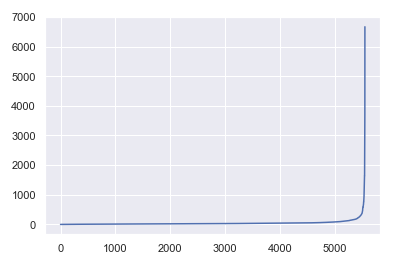

</center>

Let's zoom into the elbow where we expect the ideal *epsilon* value to be since the graph is at its maximum curvature point. 

<center>

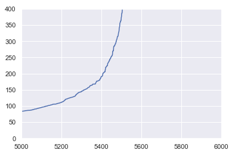

</center>

As seen from the image, the optimal value seems to be where *epsilon* = 225 as seen on the y axis. Thus, by choosing the optimal *epsilon* and *minPoints* parameters, we stand to improve the model performance. 

> Will the model work perfectly all the time?

## Limitations
It is important to note that DBSCAN is **extremely sensitive** to the choice of *epsilon*, especially if density across clusters is not standardized. 

*   *epsilon* values that are **too small** lead to less dense clusters being incorrectly classified as noise. 
*   *epsilon* values that are **too large** lead to more dense clusters being merged together to form a larger cluster.

Thus, if density across clusters vary significantly, more than one *epsilon* value is required.

> How do we perform DBSCAN clustering in R?

# Application

## Load the dataset

We will use the `multishapes` dataset in the motivation example. This dataset is freely available in the `factoextra` r library.

It consists of 3 columns: x, y and shape (which is the pre-assigned cluster values for each shape).

```{r}
data(multishapes)
head(multishapes)
```

We want to cluster the raw data points, so we'll work with the dataset without the "shapes" column.

```{r}
df <- multishapes[, 1:2]
head(df)
```

Plot the data to see how it looks.
```{r}
ggplot(df,
       aes(x,y)) +
  geom_point()
```

## Packages for DBSCAN

There are 2 possible packages you can use for DBSCAN:

*   the `fpc` library
*   the `dbscan` library

If you loaded both libraries, you can differentiate between the functions by using:

*   `fpc::dbscan()`
*   `dbscan::dbscan()`

Otherwise, you could just use `dbscan()` and r will use the function linked to your loaded library.

We will first use `fpc::dbscan()`.

## Applying `fpc::dbscan()`

The `dbscan()` function has 3 required inputs:

*   data: the input data can be a matrix or dataframe
*   eps: this specifies your reachability distance, epsilon, $\epsilon$
*   MinPts: this specifies your minimum no. of points for reachability

```{r}
library("fpc")

# Compute DBSCAN using the fpc package
set.seed(555)
fpc_db <- fpc::dbscan(data = df, eps = 0.15, MinPts = 5)
```

The animated plot below shows us how the function does clustering step-by-step!

```{r, animation.hook="gifski", interval=0.1, echo=FALSE, results='hide'}
set.seed(555)
fpc::dbscan(df, eps = 0.15, MinPts = 5, showplot = 1)
```

> You can plot each step in your code too! Just add the parameter "showplot = 1" to your dbscan() function


Let's take a look at the output:
```{r}
print(fpc_db)
```

The second row (unlabelled in the output) indicates the number assigned to each cluster.

*   Clusters 1 to 5 are the identified clusters
*   Cluster 0 indicates the noise points which don't belong to any cluster

This means there are 31 noise points.

In the output, the cluster numbers are the column headers for the rows that follow:

*   border: the number of border points in the cluster
*   seed: the number of core points in the cluster
*   total: the total number of points in the cluster


```{r}
# View the DBSCAN output structure
str(fpc_db)
```

`fpc_db$cluster` indicates the cluster number assigned to each data point


## Applying `dbscan::dbscan()`

The alternative `dbscan()` function from the `dbscan` package has the same required input parameters as the one from the `fpc` package, so it is used in a similar manner.

*   One difference to take note of is that the `MinPts` parameter in now termed as `minPts`.
```{r}
db_db <- dbscan::dbscan(df, eps = 0.15, minPts = 5)
```

The output presents information a bit more comprehensively, however it does not include information on the number of border points and core points specifically:
```{r}
print(db_db)
```

The two unlabeled rows represent the cluster numbers and total number of points in each cluster.


The structure of the output is also similar to the output for `fpc_db`:
```{r}
str(db_db)
```


## Plot the results

We will use colors to differentiate the clusters.

### Using `ggplot()`

> Let's first use ggplot to plot the results. 

Note that when using ggplot, you need to first convert your cluster values to categorical variables with the `factor()` function.
```{r}

fpc_clusters <- factor(fpc_db$cluster)

ggplot(df,
       aes(x = x, y = y, color = fpc_clusters)) +
  geom_point()

```


> Now let's take a look at some shortcuts for plotting the clusters. These don't require any preliminary steps to convert your DBSCAN output.

### Using `plot()`
```{r}
# A quick way to plot the DBSCAN results
plot(fpc_db, df, main = "DBSCAN", frame = FALSE)
```

### Using `plot.dbscan()`

This function is available in the `fpc` package.
```{r}
# Another quick way to plot the results
plot.dbscan(fpc_db, df)
```

When used with the `fpc::dbscan()` output, this plot identifies and differentiates the border points by using a different shape as the non-border (core) points. The black points are noise points, while the other colours each represent a cluster.


### Using `fviz_cluster()`

This is a function from the `factoextra` package that was created to visualize clustering results.

*Note that this only works with outputs from specific packages, so you would need to check its documentation before using this.* 

```{r}
# A function for plotting clusters
fviz_cluster(fpc_db,                      # output object from clustering package
             df,                          # input data
             geom = "point",
             main = "DBSCAN Plot",        # define plot title
             ellipse = FALSE,             # if TRUE, an ellipse is drawn around each cluster
             show.clust.cent = FALSE)     # if TRUE, extra points are plotted at each cluster's center
```

From observing the plots, the clusters appear very similar to how we would have visually grouped them. 

The noise points have also been reasonable identified. 
For example, the points loosely located around the (2, -0.5) region have been identified to be noise points. This makes sense as they are not as close to or as densely populated as the other clusters.


## Adjusting the parameters

> As mentioned in the theory section, DBSCAN is very sensitive to the `epsilon` value. Let's play around with the parameter to see its effects! 

### With a smaller *epsilon* value...
```{r}
fpc_db2 <- fpc::dbscan(data = df, eps = 0.1, MinPts = 5)

plot(fpc_db2, df, main = "DBSCAN", frame = FALSE)
```

> A lot more clusters are identified, and the clustering is not accurate.


### With a larger *epsilon* value...
```{r}
fpc_db2 <- fpc::dbscan(data = df, eps = 0.2, MinPts = 5)

plot(fpc_db2, df, main = "DBSCAN", frame = FALSE)
```

> This combined the two ovals into a single cluster.

We notice that a small 0.05 shift in epsilon value resulted in observable difference in the clustering outputs.

However, the identification of noise still seemed acceptable in these cases.


> Let's try adjusting the `MinPts` parameter instead!

### With a smaller *MinPts* value...
```{r}
fpc_db2 <- fpc::dbscan(data = df, eps = 0.15, MinPts = 2)

plot(fpc_db2, df, main = "DBSCAN", frame = FALSE)
```

> The 5 main clusters were still successfully identified!


### With a larger *MinPts* value...
```{r}
fpc_db2 <- fpc::dbscan(data = df, eps = 0.15, MinPts = 7)

plot(fpc_db2, df, main = "DBSCAN", frame = FALSE)
```

> The larger oval was split into more clusters. 


## Finding the optimal `eps` value

Since DBSCAN is sensitive to the *epsilon* value, it is extremely important that an appropriate *epsilon* value is chosen.

As mentioned in the theory section, by letting k = *minPoints*, we can plot the average distance between each point and its k nearest neighbouring points. We can then identify the optimal *epsilon* value at the point where the graph has a sharp change in slope (also known as the "knee" or elbow" point).


> So how do we implement this in R?

We can use the `kNNdistplot()` function in the `dbscan` package to plot the required plot, where k = the chosen *MinPts* value.

```{r}
dbscan::kNNdistplot(df, k =  5)

abline(h = 0.15, lty = 2)
```
> For k = 5, the optimal eps value is thus 0.15.


When we apply this method with a smaller k value (k = 3):
```{r}
dbscan::kNNdistplot(df, k =  3)
abline(h = 0.13, lty = 2)         
```
> The optimal eps value seems to be around 0.13. 


When we apply these new parameters (`eps = 0.13, MinPts = 3`), we find that the clustering turns out well too!
```{r}
fpc_db2 <- fpc::dbscan(data = df, eps = 0.13, MinPts = 3)

plot(fpc_db2, df, main = "DBSCAN", frame = FALSE)
```

Hence, it is essential to determine the appropriate parameter values to use!

> Congratulations! Now you've learned the basics and theories of DBSCAN, as well as how to implement and plot it in R! We hope this tutorial has been helpful and interesting for you!


# Sources

*   Learned information about DBSCAN from: <https://towardsdatascience.com/how-dbscan-works-and-why-should-i-use-it-443b4a191c80>

*   Learned about DBSCAN and adapted code from: <http://www.sthda.com/english/wiki/wiki.php?id_contents=7940#:~:text=dbscan()%20shows%20a%20statistic,%3D%200.15%20and%20MinPts%20%3D%205>

*   Spectral clustering vs. K means diagram was sourced from: <https://www.analyticsvidhya.com/blog/2021/05/what-why-and-how-of-spectral-clustering/>

*   K means simplified diagram was sourced from: <https://www.analyticsvidhya.com/blog/2021/04/k-means-clustering-simplified-in-python/>

*   Learned DSBCAN theory from: <https://elutins.medium.com/dbscan-what-is-it-when-to-use-it-how-to-use-it-8bd506293818>

*   DBSCAN density images and information sourced from: <https://www.geeksforgeeks.org/ml-dbscan-reachability-and-connectivity/>

*   Learned DBSCAN parameter estimation from: <https://medium.com/@tarammullin/dbscan-parameter-estimation-ff8330e3a3bd#:~:text=This%20technique%20calculates%20the%20average,on%20a%20k%2Ddistance%20graph>

*   Information about the dbscan() function was sourced from: <https://cran.r-project.org/web/packages/fpc/fpc.pdf>

*   Learned how to create animation from plots with: <https://yihui.org/en/2018/08/gifski-knitr/>

*   Information on visualizing DBSCAN was sourced from: <https://www.youtube.com/watch?v=RDZUdRSDOok>

*   The GIF on visualizing DBSCAN was created and uploaded at: <https://j.gifs.com/LZGGZp.gif>


